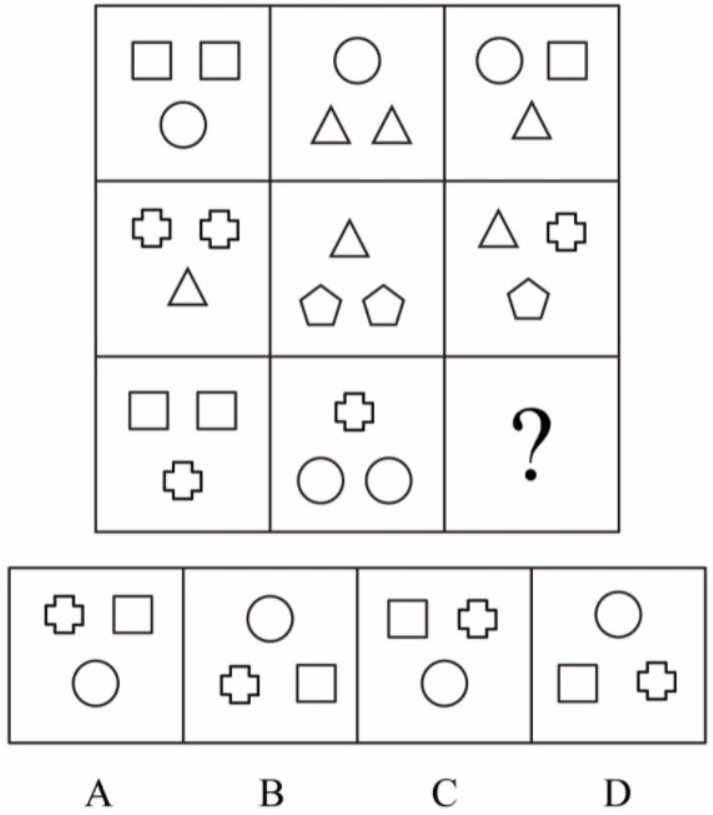
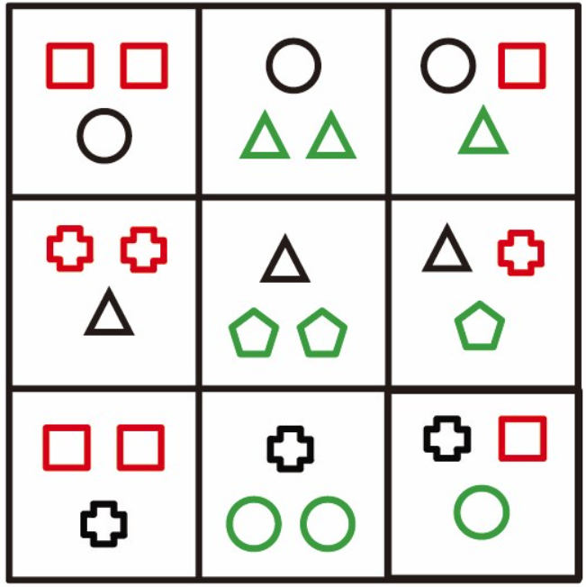
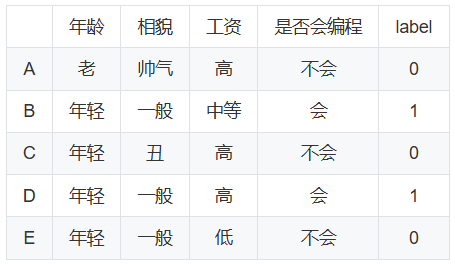
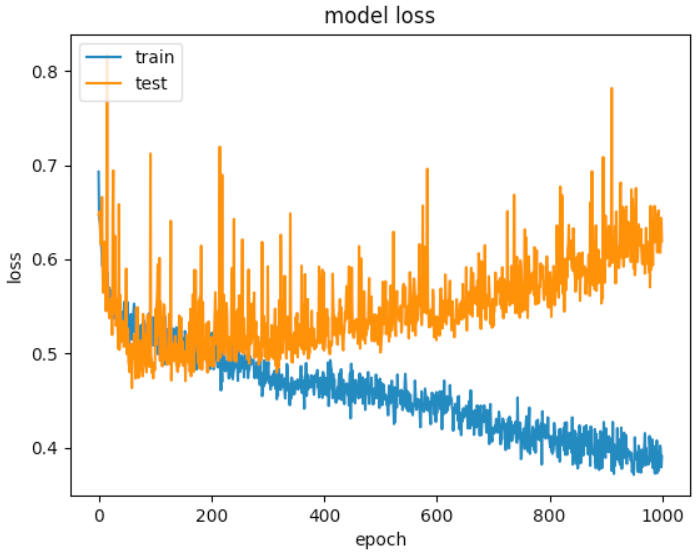
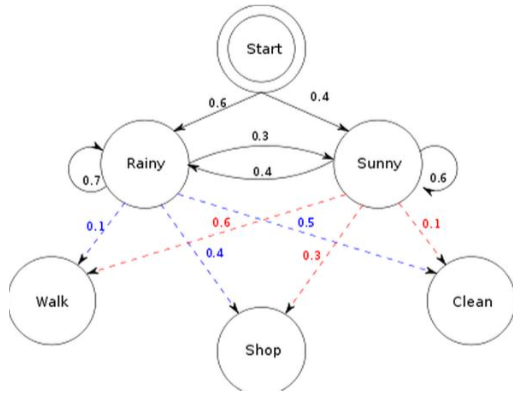

## Q1 [single] (1)

4, 10, 25，55, 100，（）

* A) 109
* B) 137
* C*) 145
* D) 169

[rubric]
第一步，观察各项数字无明显外在特征，考虑多级数列；
第二步，多级数列两两作差得到新数列：6，15，30，45，（45）；进一步观察，新数列两两之间做除法，得到2.5，2，1.5，1；因此原数列所求项为：100+45×1=145；
第三步，因此，本题答案选C。
[/rubric]

## Q2 [single] (1)

以下属于生成式模型的是（）

* A) SVM
* B) 随机森林
* C*) 隐马尔可夫模型HMM
* D) 逻辑回归

[rubric]
常见的生成式模型有隐马尔可夫模型HMM、朴素贝叶斯模型、高斯混合模型GMM、LDA等。
[/rubric]

## Q3 [single] (1)

概率论老师正在准备一场真正的概率考试，即学生所考的试题都是通过一定的`概率`决定的。首先有两种类型的试卷，分别是`easy`和`hard`。其中`hard`获得的概率是0.8，`easy`获得的概率为0.2。每份试卷都有一道压轴大题，如果试卷类型为`hard`，那么有0.9的概率压轴题为超难题；如果试卷类型为`easy`，那么压轴题只有0.15的概率是超难题。小明参加了这场考试，那么小明做的试卷的压轴题为超难题的概率是（）

* A) 0.315
* B) 0.735
* C) 0.375
* D*) 0.750

[rubric]
设事件A表示小明做的试卷的压轴题为超难题；用事件B1和B2表示小明做的试卷的试卷类型为`hard`和`easy`。
由全概率公式 $P(A)=\sum_{i=1}^{2}P(A|B_i)P(B_i)=0.9\times0.8+0.15\times0.2=0.750$。
[/rubric]

## Q4 [single] (1)

根据三元悖论，香港的联系汇率制实际上是放弃了（）

* A) 资本自由流动
* B) 汇率的稳定
* C*) 独立的货币政策
* D) 国际收支平衡

[rubric]
三元悖论：在开放经济条件下，货币政策独立性、汇率稳定性、资本完全流动性三者不可兼得；联系汇率制放弃独立货币政策。
[/rubric]

## Q5 [single] (1)

在Linux系统中，要创建一个名为 test 的目录，应该使用以下什么命令（）

* A*) mkdir test
* B) mkdir -R test
* C) touch test
* D) ls test

## Q6 [single] (1)

Web 应用程序中常使用 MVC 模式，关于说法下面哪个是错误的（）

* A) 型 (Model) 表示数据以及处理数据的业务逻辑
* B) 视图 (View) 是对模型的（可视化）展示
* C) 控制器介于用户和系统之间，协调模型和视图
* D*) MVC 的常用实践是由模型接收 GET/POST 并移交控制

[rubric]
接收 GET/POST 请求的是控制器，故 D 错。
[/rubric]

## Q7 [single] (1)

Internet的四层结构分别是（）

* A) 应用层、传输层、通信子网层和物理层
* B) 应用层、表示层、传输层和网络层
* C) 物理层、数据链路层、网络层和传输层
* D*) 网络接口层、网络层、传输层和应用层

[rubric]
TCP/IP 四层：网络接口层、网络层、传输层、应用层。
[/rubric]

## Q8 [single] (1)

以下机器学习中，在数据预处理时，不需要考虑归一化处理的是（）

* A) logistic回归
* B) SVM
* C*) 决策树模型
* D) 神经网络

[rubric]
决策树按信息增益划分，与尺度无关。
[/rubric]

## Q9 [single] (1)

设线性规划的约束条件为：

$$
\begin{cases}
x_{1}+x_{2}+x_{3} = 3 \\
2x_{1}+2x_{2}+x_{4} = 4 \\
x_1, \cdots, x_4 \ge 0
\end{cases}
$$

则基本可行解为（）

* A) (0, 0, 4, 3)
* B) (3, 4, 0, 0)
* C*) (2, 0, 1, 0)
* D) (3, 0, 4, 0)

[rubric]
代入检验，唯有 C 满足。
[/rubric]

## Q10 [single] (1)

设函数

$$
f(x)=\begin{cases}
x|x|, & x\le 0,\\
x\ln x, & x>0.
\end{cases}
$$

则 $x=0$ 是 $f(x)$ 的（）

* A) 可导点，极值点
* B*) 不可导点，极值点
* C) 可导点，非极值点
* D) 不可导点，非极值点

## Q11 [single] (1)

有关机器学习分类算法的 Precision 和 Recall，以下定义中正确的是（）

* A*) Precision= tp / (tp + fp), Recall = tp / (tp + fn)
* B) Precision = tp / (tn + fp), Recall = tp /(tp + fn)
* C) Precision = tp / (tn + fn), Recall = tp /(tp + fp)
* D) Precision = tp / (tp + fp), Recall = tp /(tn + fn)

[rubric]
精确率与召回率定义如 A。
[/rubric]

## Q12 [single] (1)

在大规模的语料中，挖掘词的相关性是一个重要的问题。以下哪一个信息不能用于确定两个词的相关性。

* A) 互信息
* B*) 最大熵
* C) 卡方检验
* D) 最大似然比

[rubric]
最大熵描述整体分布状态，与两词相关性无直接对应。
[/rubric]

## Q13 [single] (1)

设有向图 $G=(V,E)$，$V=\{V0,V1,V2,V3\}$，$E=\{\langle v0,v1\rangle,\langle v0,v2\rangle,\langle v0,v3\rangle,\langle v1,v3\rangle\}$。若从顶点 $V0$ 开始对图进行深度优先遍历，则可能得到的不同遍历序列个数是（）

* A) 2
* B) 3
* C) 4
* D*) 5

## Q14 [single] (1)

训练神经网络时可能会遇到模型迟迟不收敛的问题，下列选项中哪一个不是模型不收敛的原因（）

* A) 网络模型太深，数据量过少
* B*) 学习率设置过大
* C) 网络中存在大量梯度为0
* D) 没有对数据做归一化处理

[rubric]
学习率过大通常导致发散而非“不收敛”的典型原因描述？（按题意选 B 为“不是原因”。）
[/rubric]

## Q15 [single] (1)

从所给四个选项中，选择最适合的一个填入问号处，使之呈现一定的规律性：


* A*) A
* B) B
* C) C
* D) D

[rubric]
见解析与示意图：。
[/rubric]

## Q16 [single] (1)

Python3 正则表达式中，+ 代表什么意思（）

* A) 匹配0个或多个
* B*) 匹配1个或多个
* C) 扩展含义，0或1 或最小值
* D) 匹配除换行外任意一个字符

[rubric]
+：1个或多个；?：0或1；\*：0或多个；.：除换行任意字符。
[/rubric]

## Q17 [single] (1)

LSTM 是 RNN 的一个变体。BiLSTM 相较于 LSTM 最大的提升在于（）

* A) 更容易进行优化
* B) 训练时间更短
* C*) 既考虑上文也考虑下文
* D) 更不容易过拟合

[rubric]
BiLSTM 双向建模上下文。
[/rubric]

## Q18 [single] (1)

已知`女生不都爱逛街`为真，`男生都不爱逛街`为假。下列哪项可以判断出为真？（）

（1）女生都爱逛街，男生都不爱逛街
（2）有的女生爱逛街，有的男生不爱逛街
（3）女生都不爱逛街，男生都爱逛街

* A) 只有（1）
* B*) 只有（2）
* C) 只有（3）

[rubric]
由题干推断（2）为真，其余为假。
[/rubric]

## Q19 [single] (1)

每个 IP 地址都可以有一个主机名，通过主机名得到该主机对应 ip 地址的过程叫（）

* A) ip地址解析
* B*) 域名解析
* C) 域名编译
* D) ip地址编译

## Q20 [single] (1)

镜像是 Docker 容器的基石，容器是镜像的运行实例，实际操作中，Docker 从镜像仓库获取镜像的命令是（）

* A) get
* B*) pull
* C) fetch
* D) search

## Q21 [single] (1)

将以下6个句子重新排序，语序正确的是（ ）
① 事实上，新一轮消费券的发放热潮，较早出现在今年的中秋节。
② 作为去年疫情期间在武汉等地率先出现的手段之一，消费券的“返场”颇受关注。
③ 据媒体不完全统计，今年中秋小长假期间，近20个省市区宣布发放消费券，总金额约10亿元。
④ 只有让群众真正得到实惠，才能更好地发挥拉动消费等作用。
⑤ 国庆节期间，多地消费券发放集中发力。
⑥ 不少群众也期待着发放“少些套路”。

* A) ③①⑤②⑥④
* B) ①②⑥⑤③④
* C) ②⑥①⑤③④
* D*) ⑤②⑥①③④

[rubric]
据语义衔接与时间线判断选 D。
[/rubric]

## Q22 [single] (1)

当使用 import 导入模块时，Python 查找模块的顺序正确的是（）

① 环境变量 PYTHONPATH
② 内建模块
③ Python 安装路径
④ 当前路径（脚本所在路径）

* A) ①④②③
* B) ②①④③
* C*) ②④①③
* D) ①②③④

[rubric]
顺序：内建 > 当前路径 > PYTHONPATH > 安装路径。

## Q23 [single] (1)

优化问题：

$$
\max(4x_{1}+2x_{2}+4x_{3}+2x_{4}+x_{5}+x_{6})
$$

s.t. $4x_{1}+4x_{2}+6x_{3}+2x_{4}+3x_{5}+2x_{6}\le 11$，
$x_i\in\{0,1\}$。最优目标函数值为（）

* A) 9
* B*) 8
* C) 7
* D) 6

[rubric]
枚举满足约束的组合，最大值为 8。
[/rubric]

## Q24 [single] (1)

囚徒困境是博弈论的非零和博弈的经典例子。下列选项中不属于囚徒困境的是：

* A) 广告战
* B) 关税战
* C) 军备竞赛
* D*) 股市中的散户跟庄

[rubric]
D 不构成典型囚徒困境。
[/rubric]

## Q25 [single] (1)

强度为 $\lambda$ 的泊松过程的点间间距服从均值为（ ）的同一指数分布

* A) $\lambda$
* B*) $1/\lambda$
* C) $\lambda^2$
* D) 1

[rubric]
$X\sim \mathrm{Exp}(\lambda)$，$E[X]=1/\lambda$。
[/rubric]

## Q26 [single] (1)

以下函数的时间复杂度是（）

```python
void foo(int n, int x, int y) {
    int z = 0;
    if (n <= 0) {
       z = x + y;
    } else {
        foo(n - 1, x + 1, y);
        foo(n - 1, x, y + 1);
    }
}
```

* A*) $O(2^{n})$
* B) $O(n)$
* C) $O(\log n)$
* D) $O(n^2)$

[rubric]
递推式 $T(n)=2T(n-1)+O(1)\Rightarrow O(2^n)$。
[/rubric]

## Q27 [single] (1)

某棵完全二叉树上有 699 个节点，则该二叉树的叶子节点数为（）

* A) 349
* B*) 350
* C) 188
* D) 187

[rubric]
完全二叉树 $n_0=n_2+1$，n=699 为奇数，叶子数 $(n+1)/2=350$。
[/rubric]

## Q28 [single] (1)

QPS 的概念是什么？

* A) 商品的单月流水
* B) 独立访客数
* C*) 接口的每秒请求率
* D) 单个用户拉新成本

[rubric]
QPS = Queries Per Second。
[/rubric]

## Q29 [single] (1)

Embedding 技术在推荐系统中的应用，描述错误的是（）

* A) 作为 Embedding 层将高维稀疏转低维稠密
* B) 局部敏感哈希可做近邻搜索
* C*) 预训练 Embedding 不能与其它特征拼接训练
* D) 支持计算用户与物品相似度

[rubric]
C 错，预训练向量可与其他特征拼接联合训练。
[/rubric]

## Q30 [single] (1)

Choose the correct word to complete the sentence: "The _____ of the novel made it a bestseller."

* A*) originality
* B) origination
* C) origami
* D) orbit

## Q31 [single] (1)

在Python3中，下列程序的执行结果为（）

```
dict1 = {'one': 1, 'two': 2, 'three': 3}
dict2 = {'one': 4, 'tmp': 5}
dict1.update(dict2)
print(dict1)
```

* A) {'one': 1, 'two': 2, 'three': 3, 'tmp': 5}
* B) {'one': 4, 'two': 2, 'three': 3}
* C) {'one': 1, 'two': 2, 'three': 3}
* D*) {'one': 4, 'two': 2, 'three': 3, 'tmp': 5}

[rubric]
update 会用 dict2 覆盖同键并加入新键。
[/rubric]

## Q32 [single] (1)

Facebook 收购 WhatsApp 时仅 55 名员工，但估值 190 亿美元，其价值来源是（）

* A) 管理层
* B*) 数据
* C) 员工
* D) 文化

[rubric]
核心价值在于关系链数据与用户网络效应。
[/rubric]

## Q33 [single] (1)

以下关于 HMM 说法正确的是（）

* A) 可用于语音识别/合成/增强
* B) 能描述不平稳但可学习的时序变量
* C) 通过有序马尔科夫状态分段逼近非平稳序列
* D*) 其他说法都正确

## Q34 [single] (1)

Linux 中，执行 `chmod 644 mm.txt` 后的权限是（）

* A) drw-r--r--
* B*) -rw-r--r--
* C) lrwxr--r--
* D) rwxr- -rw-

[rubric]
6/4/4 分别对应 rw- / r-- / r--，普通文件前缀“-”。
[/rubric]

## Q35 [single] (1)

HTTP 协议中，状态码 500 的意思为（）

* A) 重定向
* B) 访问被拒绝
* C) 未找到请求的内容
* D*) 服务器内部有错误

## Q36 [single] (1)

测试的关键问题是（）

* A) 如何组织对软件的评审
* B) 如何验证程序的正确性
* C) 如何采用综合策略
* D*) 如何选择测试用例

## Q37 [single] (1)

The quality of products, ________ is promised, has improved a lot.

* A) which
* B) that
* C) it
* D*) as

[rubric]
as 引导的非限制性定语从句，代指整个主句。
[/rubric]

## Q38 [single] (1)

云计算的产品，下列选项中哪些角色是最直接的使用者？

* A) 公司高层
* B) 采购人员
* C*) 运维人员
* D) 产运人员

## Q39 [single] (1)

查看当前代码在 Git 服务器的分支列表的命令是（）

* A) git branch -a
* B) git branch -d
* C*) git branch -r
* D) git branch -s

[rubric]
-a 显示全部（本地+远程），-r 仅远程。
[/rubric]

## Q40 [single] (1)

mysql 有选课表 learn(student\_id int, course\_id int)。获取每个学生所选课程的个数，正确的 SQL 是（）

* A) select student\_id,sum(course\_id) from learn
* B*) select student\_id,count(course\_id) from learn group by student\_id
* C) select student\_id,count(course\_id) from learn
* D) select student\_id,sum(course\_id) from learn group by student\_id

## Q41 [single] (1)

中央银行降低存款准备金率后，在市场上引起的可能反应是：

* A*) 商业银行可用资金增多，贷款上升，货币供应量增多，通货膨胀
* B) 可用资金增多，贷款下降，货币供应量减少，通缩
* C) 可用资金减少，贷款上升，货币供应量增多，通胀
* D) 可用资金减少，贷款下降，货币供应量减少，通缩

## Q42 [single] (1)

关于 GBDT+LR 的“树模型+线性模型”架构，正确的是（）

* A*) (2)(3)
* B) (1)(3)(4)
* C) (2)(3)(4)
* D) (1)(2)(3)

[rubric]
(2)(3) 对，(1)(4) 错。
[/rubric]

## Q43 [single] (1)

关于 51% 攻击，下列说法正确的是？（）

* A) 攻击者要拥有51%以上的资产
* B*) 攻击者要拥有51%以上的算力
* C) 攻击者要拥有51%以上的矿机
* D) 攻击者要拥有51%以上的私钥

## Q44 [single] (1)

相亲网站特征（年龄、相貌、工资、是否会编程），采用信息增益作为准则，信息增益最大的特征是（）


* A) 年龄
* B) 相貌
* C) 工资
* D*) 是否会编程

[rubric]
计算可得信息增益：0.171、0.42、0.42、0.971；以`是否会编程`最大。
[/rubric]

## Q45 [single] (1)

如下图训练过程中 test loss 越来越大，要想使其下降，下列方法中不可行的是（ ）


* A) 对参数加入 L2 正则
* B*) 增大训练的 epoch 数
* C) 增加训练样本数
* D) 训练中加入 dropout

[rubric]
过拟合时单纯拉长训练会加剧过拟合。
[/rubric]

## Q46 [single] (1)

以下哪一个**不适合**用“离线预存推荐结果到 Redis，线上直接取”的服务方式（）

* A) 贝壳找房给新用户推荐房源
* B) 网易云音乐的热门排行榜
* C*) 新浪新闻推荐
* D) 中国移动 APP 的权益推荐

[rubric]
新闻推荐强依赖实时场景特征。
[/rubric]

## Q47 [single] (1)

少量数据且有相似任务的预训练网络，可用哪种方法利用该网络？

* A) 冻结除最后一层外所有层，仅训最后一层
* B) 对新数据重训整个模型
* C*) 只对最后几层进行微调（fine-tune）
* D) 逐层评估选择少数使用

[rubric]
通用做法：冻结多数层，微调末几层。
[/rubric]

## Q48 [single] (1)

关于决策树算法的描述正确的是（）

* A*) 在决策树中，内部结点为特征，分支为取值，叶结点为类别
* B) 决策树可看作 If-then 规则集合
* C) 以信息增益为准则递归构建
* D) 剪枝用于降低过拟合

## Q49 [single] (1)

以下哪个模型是生成式模型（）

* A*) 贝叶斯模型
* B) 逻辑回归
* C) SVM
* D) 条件随机场

[rubric]
生成式：朴素贝叶斯、GMM、HMM、贝叶斯网络等；判别式：LR、SVM、CRF 等。
[/rubric]

## Q50 [single] (1)

关于“新口罩需先甩一甩否则环氧乙烷残留致癌”的观点，以下哪项最不能削弱？（）

* A*) 一些小作坊不会使用环氧乙烷消毒
* B) 厂家残留达标后再出厂
* C) 残留量远低于致癌阈值
* D) 环氧乙烷易挥发，流通中已挥发

[rubric]
A 与论点关联弱，不能有效削弱。
[/rubric]

## Q51 [single] (1)

刘同学借王同学1万（按短期利率+1%付息），从李学长处得2万（承诺一年12%利润）。关系描述正确的是（）

* A) 王同学是股东，刘同学是债权人
* B*) 王同学是债权人，李学长是股东
* C) 王同学是股东，李学长是债权人
* D) 刘同学是债权人，李学长是股东

## Q52 [single] (1)

以下哪个不是即时战略游戏？

* A*) 英雄联盟
* B) War3
* C) 星际争霸
* D) 红色警戒

## Q53 [single] (1)

用户需求分析中，为洞察真实需求，以下最适合的方法是（）

* A) 头脑风暴法
* B*) 参与式设计
* C) 卡片分类法
* D) 调查问卷

## Q54 [single] (1)

产品术语中的 “MVP” 是什么概念？

* A) Model-View-Presenter
* B) Most-Valuable-Player
* C) Most-Visible-Project
* D*) Minimum-Viable-Product

## Q55 [single] (1)

一项调查称：普通人后代与成功人士后代同样努力，其成功几率仅为后者一半，因而“成功主要取决于遗传”。最能反驳的是：

* A) 成功人士后代往往更努力
* B) 许多成功人士后代毫无建树
* C) 很多成功人士出身普通家庭
* D*) 成功人士后代有更好的成长环境

## Q56 [single] (1)

监狱人脸识别准入系统识别四类：狱警、小偷、送餐员、其他。最适合的学习方法是？

* A) 二分类问题
* B*) 多分类问题
* C) 层次聚类问题
* D) K-中心点聚类问题

## Q57 [single] (1)

中国人民银行下调人民币存贷款基准利率属于：

* A) 紧缩性财政政策
* B) 紧缩性货币政策
* C) 扩张性财政政策
* D*) 扩张性货币政策

## Q58 [single] (1)

输入 200×200，依次经过：Conv(5×5,pad1,stride2) → Pool(3×3,pad0,stride1) → Conv(3×3,pad1,stride1)，输出特征图大小为（）

* A) 95
* B) 96
* C*) 97
* D) 98

[rubric]
(200-5+2)/2+1=99.5→取99；(99-3)/1+1=97；(97-3+2)/1+1=97。
[/rubric]

## Q59 [single] (1)

如下状态转移图，观测三天：walk，shop，clean。连续三天都下雨的情况下产生该观测序列的概率为（ ）


* A) 0.00422
* B*) 0.00588
* C) 0.00634
* D) 0.00329

[rubric]
$0.6\times0.1\times0.7\times0.4\times0.7\times0.5=0.00588$。
[/rubric]

## Q60 [single] (1)

在数据可视化中，能统计单变量离散程度、展示分布区间并突出异常值的是（ ）

* A) 饼图
* B) 柱状图
* C*) 箱型图
* D) 折线图

## 学习策略 [short] {max=20}

在大模型和智能体时代，作为个人如何持续学习和实现能力迭代？请结合以下方面简要作答：
- 学习内容选择（如技术趋势、工具使用、编程能力）
- 学习方式（如项目实践、Prompt 工程、与智能体协作）
- 能力迭代策略（如构建个人知识库、跨学科学习、反思与复盘）

[rubric]
1. 维度: 学习内容选择
   - 满分描述: 主动跟踪前沿技术（大模型、Agent 框架、工具链），明确提出学习 Python 编程的重要性，能解释其用途（调用 API、数据处理、原型开发）
   - 部分得分: 仅提到学习趋势或工具，但未提及编程能力或具体行动
2. 维度: 学习方式
   - 满分描述: 强调项目驱动学习，提到 Prompt 工程、代码实验、与智能体协作的组合方式
   - 部分得分: 仅笼统说“多学习”或“看资料”，缺少实践方法
3. 维度: 能力迭代策略
   - 满分描述: 说明如何持续复盘、更新个人知识库、跨学科学习，并提及行动周期或反馈闭环
   - 部分得分: 只提到“要不断学习”，缺乏具体迭代方法
4. 维度: 综合性
   - 满分描述: 答案有条理、结合个人行动计划，体现思考深度，逻辑连贯
   - 部分得分: 内容零散或只罗列关键词，无清晰逻辑
[/rubric]


## 逻辑推演 [short] {max=20}

大模型与智能体时代，是否能够消除信息差？是否能够消除信息茧房？
或者它们从更深层次创造了新的信息差与思维逻辑差？
它们会让人类社会变得更好，还是可能引发更大的撕裂？
是否会像互联网或智能手机一样，带来全人类普适性的技术红利？

请结合个人观察、案例或推理，简要阐述你的观点。

[rubric]
1. 维度: 立场与观点
   - 满分描述: 清晰表明立场（如能否消除信息差、是否会引发社会撕裂），并给出充分理由
   - 部分得分: 仅表明态度，没有给出理由或理由过于笼统
2. 维度: 多维度分析
   - 满分描述: 涵盖信息差、信息茧房、社会分裂、技术普惠性等多个层面，有横向对比（如与互联网、智能手机的类比）
   - 部分得分: 只谈及其中一个或两个方面，缺少对比和多维度分析
3. 维度: 深度与批判性
   - 满分描述: 指出潜在风险、边界条件和反例，如大模型可能加剧信息茧房、强化算法偏见，或创造新的精英/大众鸿沟
   - 部分得分: 只给出乐观或悲观的一面，缺少辩证思考
4. 维度: 综合性与逻辑
   - 满分描述: 论证结构清晰，有因果推理或场景假设，结论与论点一致
   - 部分得分: 内容零散、堆砌观点，没有清晰逻辑
[/rubric]